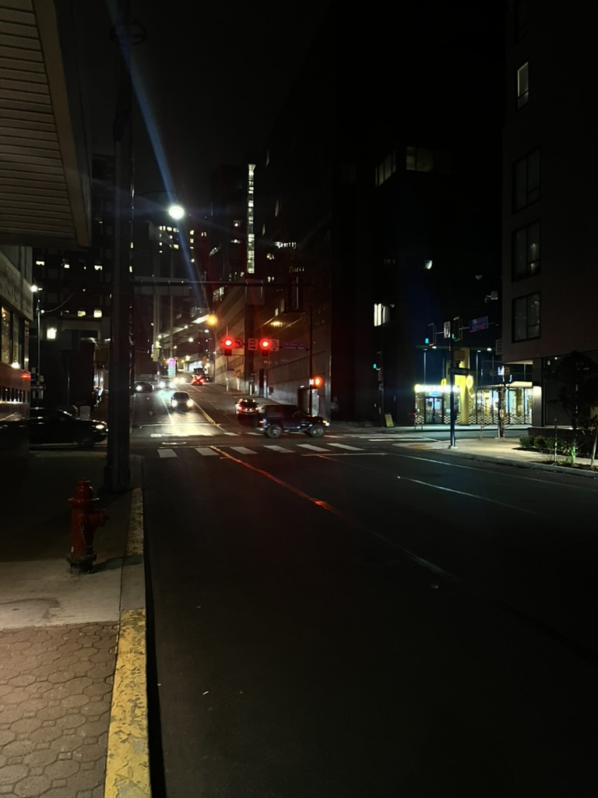
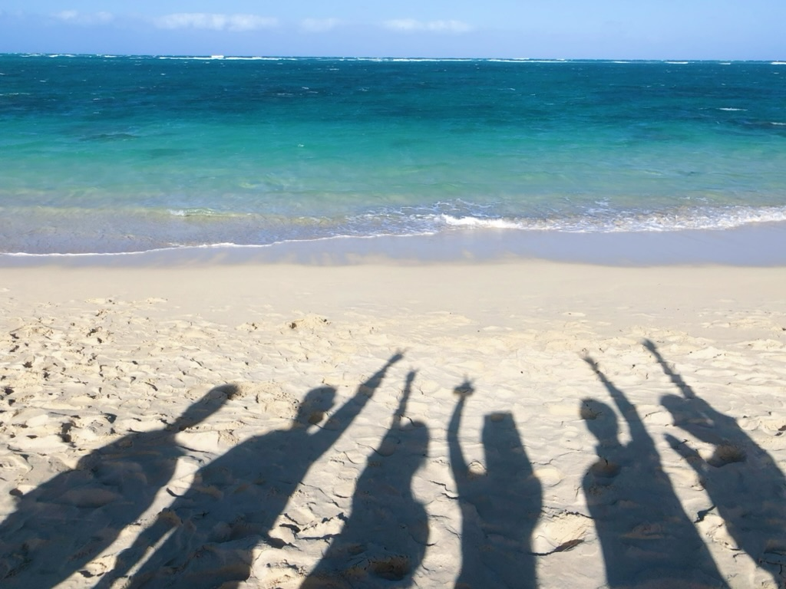
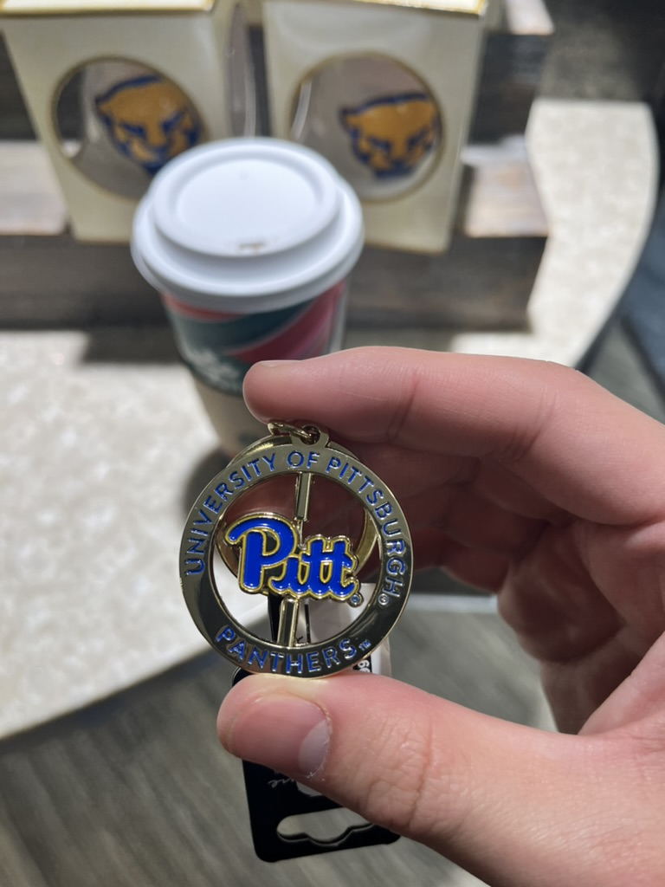

昨晚出门去Kinross健身的时候，发现LA也是降温到了穿短袖短裤会觉得阴冷的季节了。奇怪的是，明明是在五十多华氏度的加州穿短袖的场景，一刹那让我闪回了23年12月那个在寒冷的匹兹堡穿着外套走出酒店的夜晚，当时我拍下了下面这张照片。

我问自己，你为什么怀念匹兹堡？我明明只在那里度过了非常短暂的两天，更精确地说，是只有一天加若干小时，甚至只认真逛过Pitt周围的方圆2miles范围。但是一切的场景在我脑海中仿佛还只是昨日，我清楚地记得凌晨五点，和两个好友L和H，在精神航空上折磨了五个小时后走出匹兹堡机场，迎面吹来的冷风给我那种不真实的感觉，对了，那是我整整15个月里第一次被零度以下的风吹在脸上。我也清楚地记得，在L的公寓里帮他把床垫桌子搬到垃圾箱，然后L指着公寓里最后剩下的一个muffin说这个极其难吃。我还记得，在时隔一个月没有踏上球场之后，在匹兹堡的夜晚我踢了一场野球，踢完野球去赶着关门之前去买tenders吃，那应该是我在美国吃到的最好吃的美式鸡柳了！还有那个开在居民区的house里的川菜馆，卖川菜和烤鱼烤串，周围的桌子坐着Pitt的学生，聊着和LA留学生一样那种琐事。

所以我怀念的是这些经历吗？但好像这些事情我在LA都经历过，那也许答案是这座城市的独特？哦也许是，匹兹堡确实是一座结构布局非常奇怪的城市，无论是那条贯穿学校/公寓/超市/餐厅的主干道，还是开在house里的川菜馆，都是在LA从来没有见过的。而另一方面，匹兹堡又是一座非常宁静的城市，清冷的早晨里可以看到很多拿着咖啡赶路的上班族，到了晚上路上又只有寥寥无几的车辆。这里的城区好像很少看到轰鸣的跑车，也很少看到开到夜晚给需要夜生活的人的餐厅酒吧，也许正是这种和LA的反差感带来了迷人的地方吧！

Oh不对，因为似乎我却也从来没对LA的热烈与节奏产生过厌倦。所以可能我怀念的并不是那个地点，而是那段时间，在经历了在LA的琐事之后，能和我最熟悉的朋友之二，在距离家乡遥远的一座城市，却可以度过那短暂的没有烦恼的时光。那两天也是L在匹兹堡读书的经历中的最后两天，我真的无法设身处地地自己去体会，也许只有若干年后我离开LA的时候才能感受到了，真的应该会是一种很复杂的感觉吧！当时同行的两位老友L和H，以及另一位在LA的老友Z，如今都已经回到了上海工作----因此，明明去匹兹堡只是一年前的事情，但似乎却再也回不到那个时候了。国内的好友D问我：“你不怀念国内去过的那些地方吗”，我说，我也怀念拉萨的那一天，也怀念重庆的深夜，但是我知道我一定会有那么一天跟你们一起再去拉萨吃藏面，也一定会有一天跟你们再去重庆的深夜寻找还在营业的小面，然而，很有可能不会再在那种心境下和最熟悉的朋友们去匹兹堡了。

写到这里我真的需要再次感叹一句，Damn！我真的无比怀念那个冬天！我去了夏威夷，匹兹堡和纽约，去看看Cali以外的世界。我当时给那个十二月命名叫“留给自己的十二月”，现在觉得应该改成“留给我和我的朋友们的十二月”，因为没有他们，这一切也将索然无味。他们在中国或是美国的不同地方，也像我一样时不时抱怨一下工作或学习的烦恼。希望可以早点和他们再见面聊聊最近的drama，最近的笑话，最近的困难，最近的收获吧。

哦对，我还逛了一次Pitt校园，我仍然记得拿着一杯Hot Chocolate在校园商店里的感觉。我在那里买了一个挂件，现在就挂在我的书包上：

